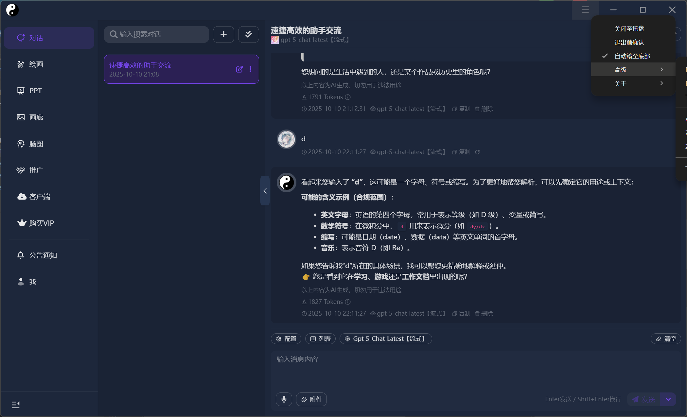

# 太极 Ai - 客户端

## 简介

一个基于electron的非官方客户端，该项目改善原客户端依托答辩的使用体验，并添加了更多功能。

#### 目前实现功能如下:

- [x] 窗口操作栏（窗口拖拽移动、最小化、最大化、关闭）
- [x] 操作栏是否显示的控制按钮（左上角的图标）
- [x] 页内查找搜索功能, 支持快捷键
- [x] 软件关闭至托盘
- [x] 软件退出前确认
- [x] 永不**主动**显示网站公告（除了第一次使用软件）
- [x] 聊天发送/回车后自动滚动到聊天底部
- [x] 托盘图标
- [x] 系统主题
- [x] 软件自动静默更新
- [x] 网页内部链接自动跳转到系统浏览器
- [x] CSS 样式优化，顺手修了部分显示BUG



## 项目配置

### 安装依赖

```bash
$ pnpm
# npm
# yarn
```

### 运行调试

```bash
# 开发调试
$ pnpm dev

# 构建预览
$ pnpm start

# 渲染器调试
$ pnpm dev --rendererOnly

# 热重载调试
$ pnpm dev --w
```

> [!TIP]
> `断点调试`详见[这篇文章](https://cn.electron-vite.org/guide/debugging#webstorm)

### 构建发布

```bash
# For windows
$ pnpm build:win

# For macOS
$ pnpm build:mac

# For Linux
$ pnpm build:linux
```
