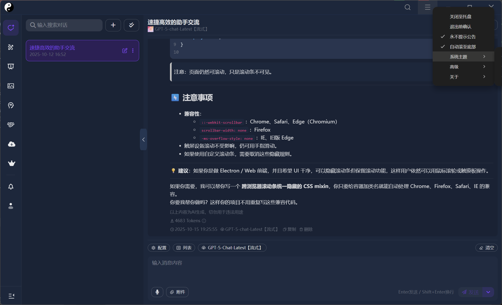

# 太极 Ai - 客户端

## 简介

一个基于electron的非官方客户端，该项目改善原客户端依托答辩的使用体验，并添加了更多功能。



## 项目配置

### 安装依赖

```bash
$ pnpm
# npm
# yarn
```

### 运行调试

```bash
# 开发调试
$ pnpm dev

# 构建预览
$ pnpm start

# 渲染器调试
$ pnpm dev --rendererOnly

# 热重载调试
$ pnpm dev --w
```

> [!TIP]
> `断点调试`详见[这篇文章](https://cn.electron-vite.org/guide/debugging#webstorm)

### 构建发布

```bash
# For windows
$ pnpm build:win

# For macOS
$ pnpm build:mac

# For Linux
$ pnpm build:linux
```
